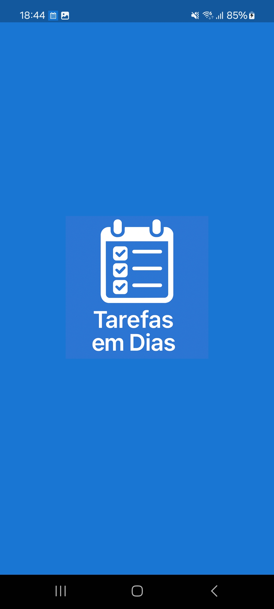
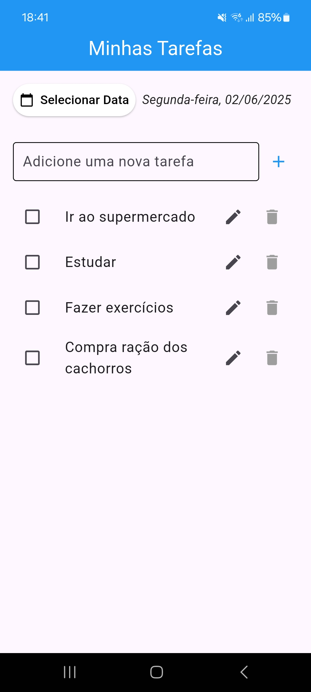
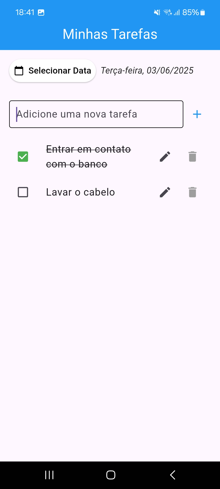
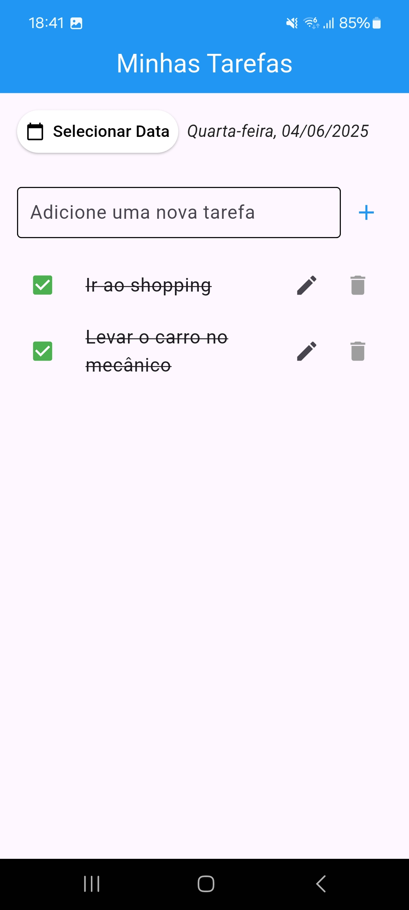
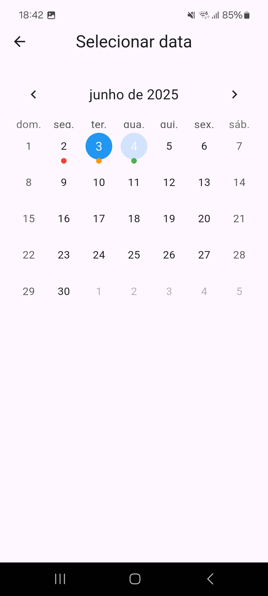
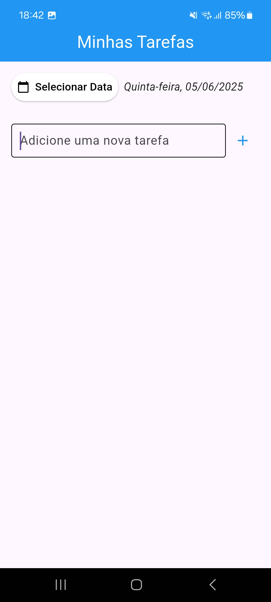
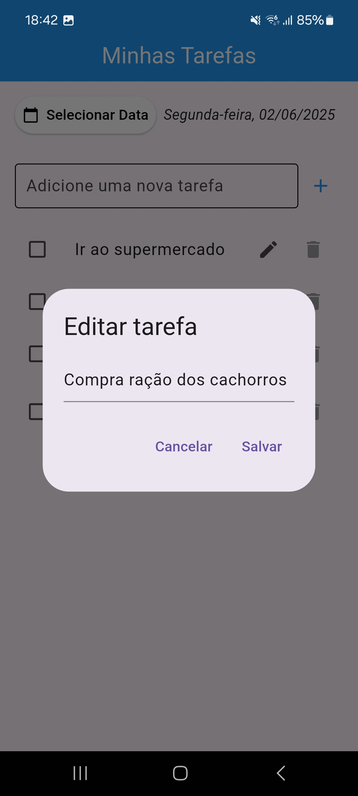

# ✅ Tarefas em Dias

Aplicativo de lista de tarefas diário feito com Flutter.  
Organize seu dia, marque tarefas como concluídas, visualize por data no calendário e receba notificações automáticas de lembrete.  
Este é meu primeiro projeto Flutter, desenvolvido como parte do meu aprendizado em programação.

---

## 🧩 Funcionalidades

- ✅ Adicionar novas tarefas por data  
- ✏️ Editar e excluir tarefas  
- ☑️ Marcar tarefas como concluídas  
- 📅 Selecionar datas com calendário  
- 🔔 Notificações automáticas para tarefas pendentes  
- 💾 Armazenamento local com `SharedPreferences`  
- 🧠 Retenção de dados mesmo após fechar o app  
- 🎯 Interface intuitiva e 100% em português  

---

## 📸 Screenshots

<p align="center">
  
</p>

<p align="center">
  
</p>

<p align="center">
  
</p>

<p align="center">
  
</p>

<p align="center">
  
</p>

<p align="center">
  
</p>

<p align="center">
  
</p>

---

## 🛠️ Tecnologias

- [Flutter](https://flutter.dev/)
- [Dart](https://dart.dev/)
- [SharedPreferences](https://pub.dev/packages/shared_preferences)
- [Awesome Notifications](https://pub.dev/packages/awesome_notifications)
- [Table Calendar](https://pub.dev/packages/table_calendar)

---

## 🚀 Como rodar o projeto localmente

1. Clone este repositório:

```bash
git clone https://github.com/Andrealysson/tarefas-em-dias.git
